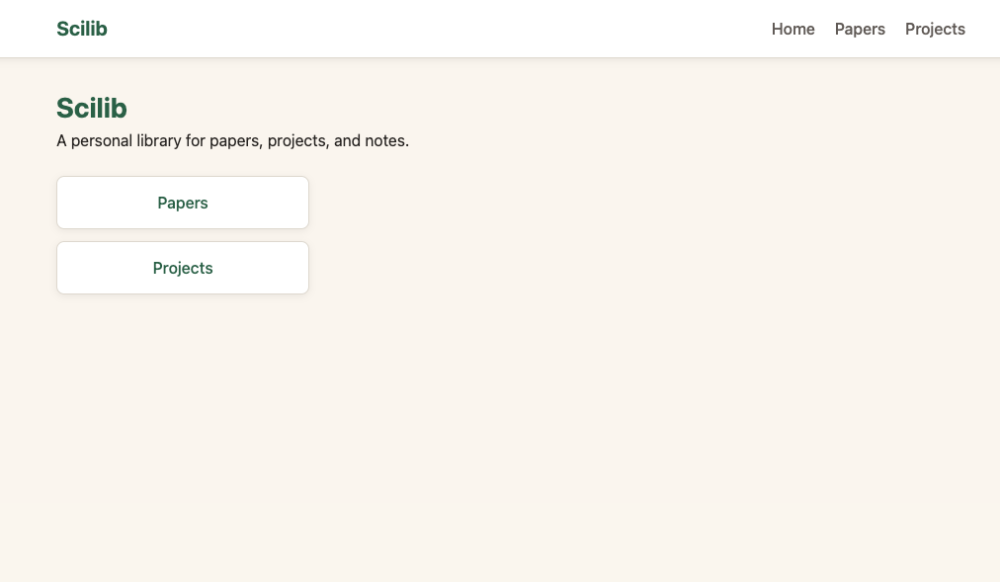
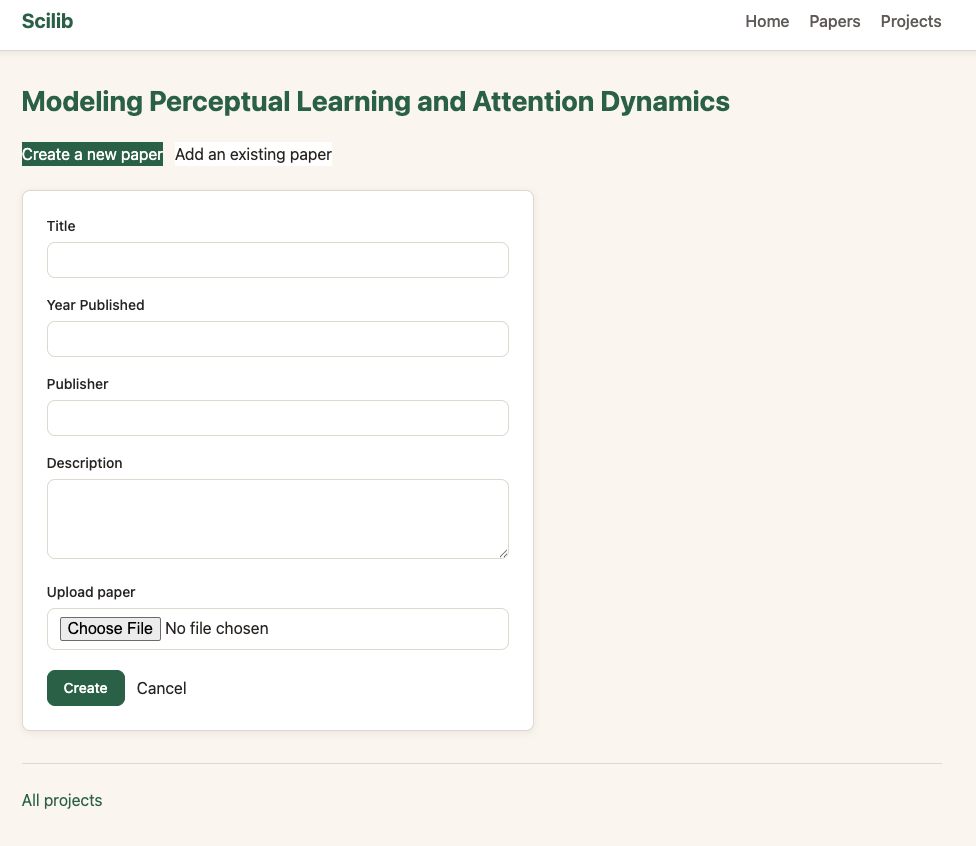

# Scilib

Scilib is a personal library for organizing academic papers, grouping them into research projects, and annotating them with notes. 
It's a small Rails app I use to keep track of what I'm reading, and keep my notes organized. It solves two problems for me:
1. Accessing notes that I take for a paper across different machines
2. Organizing papers among multiple projects since a single paper might be relevant to multiple research tracks. 

Future features:
1. Ability to toggle on/off notes based on project. (For paper A, which belong to projects 1, 2, and 3, I can turn off my notes which are relevant to projects 2 and 3 when working on project 1).



## Overview

- **Papers** — a central catalog of papers with title, publisher, year published, and an uploaded PDF you can view in the browser.
- **Projects** — a way to group papers around a research question or topic. A project can pull in existing papers from the library or spin up brand new ones.
- **Notes** — per-project, per-paper annotations with a category (highlight, question, disagreement, inspiration) and a rank, so you can flag what mattered most about a passage while reading it within a specific project's context.



## Technologies used

- **[Ruby on Rails 7.1](https://rubyonrails.org/)** — the app is a straightforward CRUD-heavy Rails monolith (papers, projects, notes), so a batteries-included MVC framework gets the job done without needing a separate API layer or frontend build pipeline.
- **[Hotwire](https://hotwired.dev/) (Turbo Rails + Stimulus)** — Turbo Streams broadcast new/removed papers and notes to connected clients in real time (e.g. adding a note updates the list instantly), and Turbo Frames drive the modal for adding existing papers to a project. This gets SPA-like interactivity without writing a JavaScript frontend.
- **[Import maps](https://github.com/rails/importmap-rails)** — ships Stimulus/Turbo straight to the browser via ESM without a Node-based JS bundler, which keeps the frontend tooling minimal for an app this size.
- **[Action Cable](https://guides.rubyonrails.org/action_cable_overview.html) + [Redis](https://redis.io/)** — backs the Turbo Stream broadcasts (`broadcast_append_to`/`broadcast_remove_to` in the `Paper` and `Note` models) with pub/sub so updates propagate across connections.
- **[MySQL](https://www.mysql.com/) (via `mysql2`)** — the primary datastore. Uploaded PDFs are stored directly as binary columns on the `papers` table rather than through Active Storage, keeping paper data self-contained in one place.
- **[RMagick](https://github.com/rmagick/rmagick) + [pdf2image](https://github.com/kanety/pdf2image)** — used to rasterize uploaded PDFs so paper content can be rendered/previewed in the browser.
- **[Puma](https://github.com/puma/puma)** — the app server, Rails' default choice for both development and production.
- **Docker** — a multi-stage `Dockerfile` is included for building a production image, so the app can be deployed the same way it's tested locally.

## Running locally

### Prerequisites

- Ruby 3.2.2 (see `.ruby-version`)
- MySQL server running locally
- Redis server running locally (for Action Cable / Turbo Streams)

### Setup

```bash
# Install gems
bundle install

# Create and migrate the database
bin/rails db:create db:migrate

# Start Redis if it isn't already running
redis-server

# Start the app
bin/rails server
```

A directory "images" must be created under app/assets where papers will be stored locally. For now, the app only saves
papers locally to avoid exposing material that does not belong to the user to the internet.

Then visit [http://localhost:3000](http://localhost:3000).

### Configuration notes

- Database connection settings live in `config/database.yml` (defaults to a local MySQL instance on `127.0.0.1:3306` with user `root` and no password — adjust to match your local setup).
- Action Cable's Redis URL is configured in `config/cable.yml` (defaults to `redis://localhost:6379/1`).

### Tests

```bash
bin/rails test
```

System tests use Capybara with Selenium/Webdrivers, so a browser driver needs to be available locally to run them.
